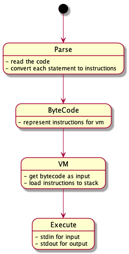

# brainfuck programming
just for fun :)

stack based vm for BrainFuck. 

* bfc for compiler
* bf for running bytecode


## build compiler - bfc
```bash
go build cmd/compiler/bfc.go
```

that command creates bytecodes like 
```
INC 1
JZBRACKET 41
INCPTR 1
INC 1
```

## build vm - bf
```bash
go build cmd/vm/bf.go
```

## create bytecode
```bash
./bfc samples/helloworld.bf
```

## run bytecode
```bash
./bf samples/helloworld.bf.bytecode
```

## instruction list

| Statement | Operator | Desc | 
|   :--     |    :--  |   :--    |
| + | INC| increment (increase by one) the byte at the data pointer|
| - |DEC|decrement (decrease by one) the byte at the data pointer|
| >|INCPTR|increment the data pointer to point to the next cell to the right|
| < |DECPTR|decrement the data pointer to point to the next cell to the left|
| [ |JZBRACKET|if the byte at the data pointer is zero, then instead of moving the instruction pointer forward to the next command, jump it forward to the command after the matching `]`|
| ] |JNZBRACKET|if the byte at the data pointer is nonzero, then instead of moving the instruction pointer forward to the next command, jump it back to the command after the matching `[` command|
| . |PUTCHAR|output the byte at the data pointer|
| , |GETCHAR|accept one byte of input, storing its value in the byte at the data pointer|

## Reference 
* https://gist.github.com/roachhd/dce54bec8ba55fb17d3a
* https://thorstenball.com/blog/2017/01/04/a-virtual-brainfuck-machine-in-go/
* https://blog.klipse.tech/brainfuck/2016/12/17/brainfuck.html